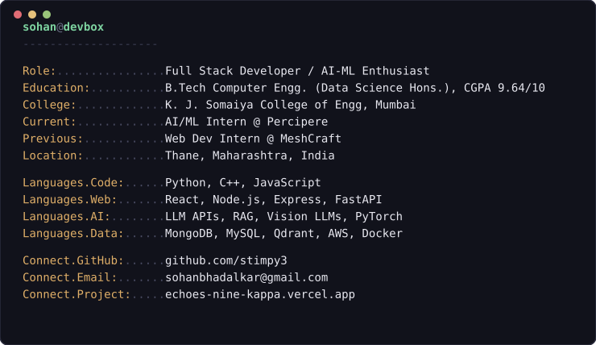

```
                                 ___           ___           ___       ___       ___     
                                /\__\         /\  \         /\__\     /\__\     /\  \    
                               /:/  /        /::\  \       /:/  /    /:/  /    /::\  \   
                              /:/__/        /:/\:\  \     /:/  /    /:/  /    /:/\:\  \  
                             /::\  \ ___   /::\~\:\  \   /:/  /    /:/  /    /:/  \:\  \ 
                            /:/\:\  /\__\ /:/\:\ \:\__\ /:/__/    /:/__/    /:/__/ \:\__\
                            \/__\:\/:/  / \:\~\:\ \/__/ \:\  \    \:\  \    \:\  \ /:/  /
                                 \::/  /   \:\ \:\__\    \:\  \    \:\  \    \:\  /:/  / 
                                 /:/  /     \:\ \/__/     \:\  \    \:\  \    \:\/:/  /  
                                /:/  /       \:\__\        \:\__\    \:\__\    \::/  /   
                                \/__/         \/__/         \/__/     \/__/     \/__/    
```

<p align="center">
  
</p>

<h3 align="center">🚀 Full Stack Developer | AI/ML Enthusiast | Building Scalable Web Apps & Intelligent Systems</h3>

---

### 💼 Experience
- **AI/ML Intern, Percipere** *(Jun 2026 – Jul 2026)* — Built cost-optimized LLM web-search & RAG pipelines, and a change-request detection system using hybrid BM25 + MiniLM retrieval.
- **Web Development Intern, MeshCraft** *(Dec 2025 – May 2026)* — Built a real-time AI voice assistant for farmers with multilingual STT/TTS pipelines and Exotel telephony.

---

### 🚧 Projects
- **MedScan – AI Medicine Intelligence App (MVP)** | React Native, Node.js, MongoDB, Groq, Vision LLMs, RxNorm — Medicine substitution engine and Vision LLM prescription scanner powering a scan-to-chat assistant.
- [Echoes – Geo-Social Web App](https://echoes-nine-kappa.vercel.app/) | React, Node.js, MongoDB, Leaflet.js, Socket.io, Cloudinary — Real-time geo-social platform with a hybrid K-Means recommendation engine.
- **NeerRikshan – Glacial Lake Watch (MVP)** | Python, PyTorch, GEE, FastAPI, React, MapLibre — Frozen U-Net segmentation and uncertainty-quantified trend detection over 867 Himalayan lakes, powering a downstream-exposure risk screening tool validated against an independent satellite inventory.

---

### 🛠️ Languages and Tools

<div align="left">
  
  
  
  
  
  
  
  
  
  
  
  
  
  
  
  
  
  
  
  
  
  
  
  
  
  
  
  
  
</div>

---

### 📊 GitHub Stats

<div align="center">
  
  
</div>

---

### 🌐 Connect with Me

<p align="left">
  <a href="https://github.com/stimpy3"></a>
</p>
